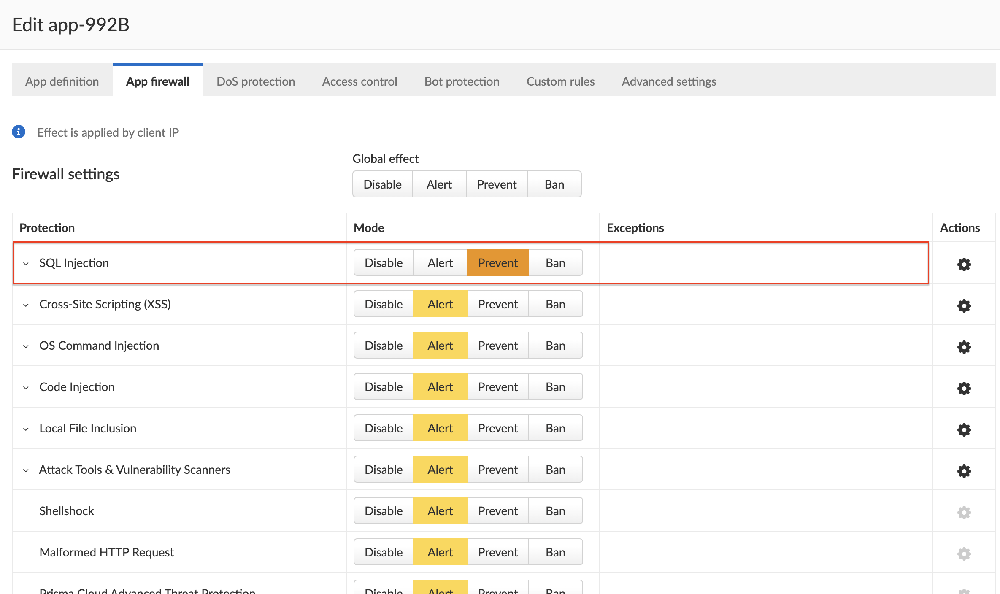
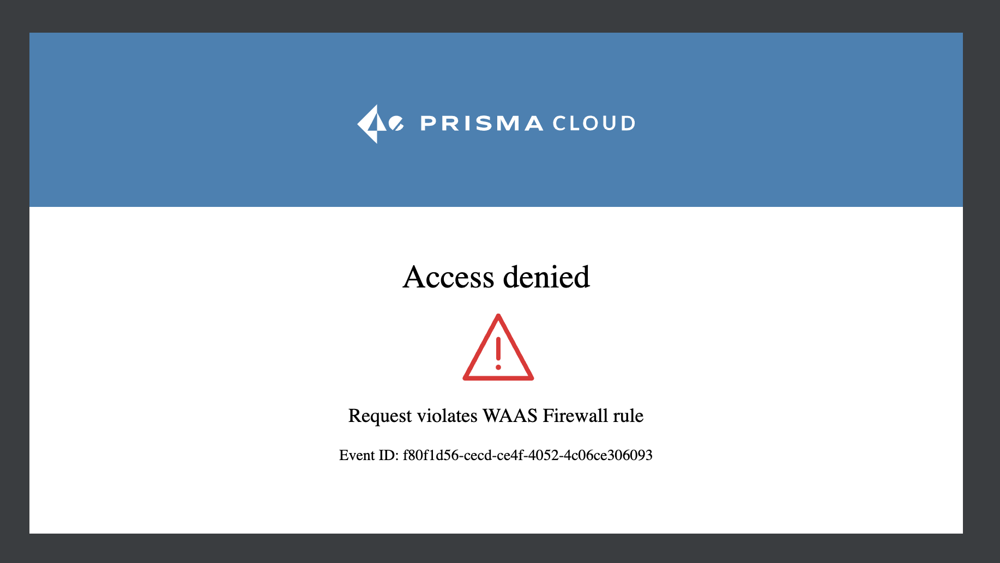

# top10owasp-tool


This tool can be used to generate top10owasp attacks and test WAAS Prisma Cloud application's ability to detect and block them.

### Usage

Print help

```bash
$ ./top10owasp-tools-test.sh

Tool to generate Top10 Owasp queries to test detection capabilities of Prisma Cloud WAAS.
Please complete the fields: appurl and attack-type
usage: ./top10owasp-tools-test.sh <AppURL> <AttackType>
example: ./top10owasp-tools-test.sh http://a15d06e1184fc4053a062959791f2cb1-451058516.eu-west-3.elb.amazonaws.com:80 sql-injection
Available top10 owasp attack type

sql-injection (Run sql injection test resquest)
css-xss (Run Cross-site scripting test resquest)
os-cmd-injection (Run OS command injection test resquest)
code-injection (Run Code injection test resquest)
local-file-inclusion (Run Local file inclusion test resquest)
attack-tools (Run Local file inclusion test resquest)
shellshock-protection (Run Shellshock protection test resquest)
malformed-http (Run Malformed HTTP test resquest)
http-header-access-control (Run HTTP header access controls test resquest)
```


### Example Activation, detection and blocking by the Prisma Cloud Defender

##### Injection (A03_2021)

https://owasp.org/Top10/A03_2021-Injection/

Generate SQL Injection attack 

```bash
$ ./top10owasp-tools-test.sh <app-url> sql-injection
```

<u>Configure</u>

- From Prisma Cloud App configuration, enable **SQL injection Prevent Mode**



<u>Run test</u>

```bash
$ ./top10owasp-tools-test.sh http://a15d06e1184fc4053a062959791f2cb1-451058516.eu-west-3.elb.amazonaws.com:80 sql-injection
Run SQL Injection request on http://a15d06e1184fc4053a062959791f2cb1-451058516.eu-west-3.elb.amazonaws.com:80
RUN : curl -I http://a15d06e1184fc4053a062959791f2cb1-451058516.eu-west-3.elb.amazonaws.com:80\?id\=%27%20OR%20%271

```

<u>Response:</u>

```bash
HTTP/1.1 403 Forbidden
X-Prisma-Event-Id: 77dd4832-a3c4-06d1-4d8c-a8ef95ae9898
Date: Mon, 04 Sep 2023 06:34:55 GMT
Content-Type: text/html; charset=utf-8
```

<u>Test from browser:</u>



<u>Log from Prisma:</u>


### OWASP Top ten attack type

- Types of OWASP attacks : https://owasp.org/www-community/attacks/
- Prisma Cloud WAAS App firewall : https://docs.paloaltonetworks.com/prisma/prisma-cloud/prisma-cloud-admin-compute/waas/waas_app_firewall

| Attack Type                 | Commentaire                                                  | Lien                                                         |
| --------------------------- | ------------------------------------------------------------ | ------------------------------------------------------------ |
| injection                   | A SQL injection attack consists of insertion or “injection” of a SQL query via the input data from the client to the application. A successful SQL injection exploit can read sensitive data from the database, modify database data (Insert/Update/Delete), execute administration operations on the database (such as shutdown the DBMS), recover the content of a given file present on the DBMS file system and in some cases issue commands to the operating system. SQL injection attacks are a type of injection attack, in which SQL commands are injected into data-plane input in order to affect the execution of predefined SQL commands. | https://owasp.org/www-community/attacks/SQL_Injection        |
| Cross-site scripting        | Cross-Site Scripting (XSS) attacks are a type of injection, in which malicious scripts are injected into otherwise benign and trusted websites. XSS attacks occur when an attacker uses a web application to send malicious code, generally in the form of a browser side script, to a different end user. Flaws that allow these attacks to succeed are quite widespread and occur anywhere a web application uses input from a user within the output it generates without validating or encoding it. | https://owasp.org/www-community/attacks/xss/                 |
| OS command injection        | Command injection is an attack in which the goal is execution of arbitrary commands on the host operating system via a vulnerable application. Command injection attacks are possible when an application passes unsafe user supplied data (forms, cookies, HTTP headers etc.) to a system shell. In this attack, the attacker-supplied operating system commands are usually executed with the privileges of the vulnerable application. Command injection attacks are possible largely due to insufficient input validation. | https://owasp.org/www-community/attacks/Command_Injection    |
| Code injection              | Code Injection is the general term for attack types which consist of injecting code that is then interpreted/executed by the application. This type of attack exploits poor handling of untrusted data. These types of attacks are usually made possible due to a lack of proper input/output data validation. | https://owasp.org/www-community/attacks/Code_Injection       |
| Local file inclusion        | The File Inclusion vulnerability allows an attacker to include a file, usually exploiting a “dynamic file inclusion” mechanisms implemented in the target application. The vulnerability occurs due to the use of user-supplied input without proper validation. | https://owasp.org/www-project-web-security-testing-guide/v42/4-Web_Application_Security_Testing/07-Input_Validation_Testing/11.1-Testing_for_Local_File_Inclusion |
| Attack Tools                | Vulnerability scanners are automated tools that scan web applications for known security vulnerabilities and misconfiguration.<br />Web crawlers are automated tools designed to systematically access and enumerate the content of web applications. Crawling can lead to data breaches by exposing resources that should not be publicly available, or revealing opportunities for hacking by exposing software versions, environment data, and so on.<br />WAAS is continuously updated with new signatures of widely used web attack arsenal, crawlers and penetration testing tools. |                                                              |
| Shellshock protection       | Shellshock is effectively a Remote Command Execution vulnerability in BASH.<br />The vulnerability relies in the fact that BASH incorrectly executes trailing commands when it imports a function definition stored into an environment variable<br /><br />Shellshock is a unique privilege escalation vulnerability that permits remote code execution. In unpatched versions of the bash shell interpreter, the Shellshock vulnerability lets attackers create environment variables with specially crafted values that contain code. As soon as the shell is invoked, the attacker’s code is executed. |                                                              |
| Malformed HTTP              | WAAS is continuously updated with new signatures of widely used web attack arsenal, crawlers and penetration testing tools.WAAS checks for requests that are crafted to exploit the Shellshock vulnerability.WAAS validates the structure of HTTP requests, automatically blocking those that are malformed.<br />Examples of malformed requests include:<br /><br />- HTTP GET requests with a body. <br />- HTTP POST requests without a Content-Length header. |                                                              |
| HTTP header access controls | <br />Header access controls to exclude or allow connection.<br />Specify the name of an HTTP header to be excluded in the form of a regular expression (re2), e.g. [^X-API-.{3,5}$](https://docs.paloaltonetworks.com/prisma/prisma-cloud/prisma-cloud-admin-compute/waas/waas_app_firewall#) or [^Host$](https://docs.paloaltonetworks.com/prisma/prisma-cloud/prisma-cloud-admin-compute/waas/waas_app_firewall#). |                                                              |

